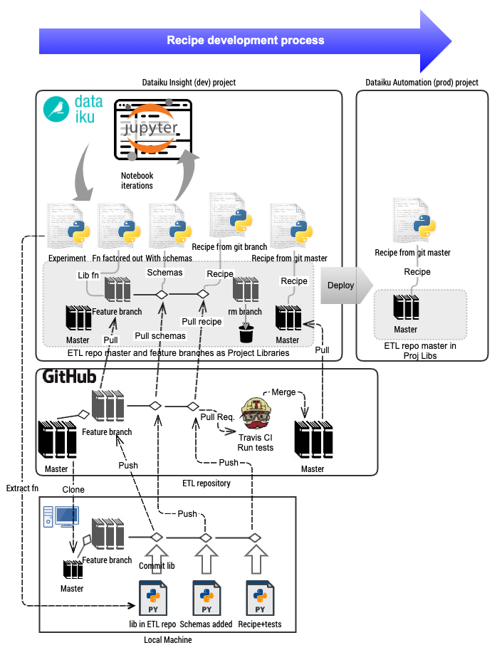

# Birgitta

[](https://en.wikipedia.org/wiki/MIT_License)
[](https://travis-ci.org/telia-oss/birgitta)
[](https://pypi.python.org/pypi/birgitta)
[](https://coveralls.io/github/telia-oss/birgitta?branch=master)

Birgitta is a Python ETL test and schema framework, providing automated tests for pyspark notebooks/recipes.

Birgitta allows doing solid ETL and ML, while still liberally allowing imperfect notebook code, enabling a [DataOps](https://www.dataopsmanifesto.org) way of working, which is both solid and agile, not killing Data Scientist flexibility by excessive coding standards in notebooks.

In addition to running recipetests on your local dev machine or on a CI/CD server, there is support for running recipetests as [Dataiku](https://www.dataiku.com) DSS Scenarios.

## Philosophy

The overall goal of Birgitta is to solidify Data Engineering and ETL, especially in pyspark, through automated tests, tribulations and discipline.

> > **“You are like precious gold that is laid on a hard anvil and hammered, for you were hammered with every kind of tribulation”**
>
> *From The Prophecies and Revelations of Saint Birgitta (Bridget) of Sweden, Chapter 20*

## Solid yet flexible development

An example of how to use Birgitta in a development process in [Dataiku](https://www.dataiku.com), is found [in this tutorial](./docs/dev_process/dataiku.md). Here is a visualization of that process:



## Installation

```bash
$ pip install birgitta
```

## Introduction

To test pyspark code and notebooks we want input fixtures (test data) and expected output fixtures and schema definitions for input and output datasets. With these, we automatically test pyspark code and notebooks in [pytests](https://docs.pytest.org/en/latest/).

Here is an [example test](newsltd_etl/projects/tribune/tests/recipes/test_daily_contract_states.py). For clarity, the schemas, fixtures and tests are split up into separate files and folders.

These are:

* `recipe` a pyspark file, whose content is collection of lines of code in a notebook, containing only python cells. [Example](newsltd_etl/projects/tribune/recipes/compute_daily_contract_states.py).
* `dataset` a dataset has name and schema. [example](newsltd_etl/projects/tribune/datasets/daily_contract_states/__init__.py).
* `schema` a definition of a dataset, [example](newsltd_etl/projects/tribune/datasets/daily_contract_states/schema.py).
* `catalog` a list of fields (columns/features) with example fixture values. [Example](newsltd_etl/shared/schema/catalog/tribune.py).
* `fixtures` example data used to test recipes, either as input data or expected output data. Here is an [example fixture](newsltd_etl/projects/tribune/tests/fixtures/generated_json/daily_contract_states/fx_default.json), which has been generated from the [fixture definition](newsltd_etl/projects/tribune/tests/fixtures/daily_contract_states.py).
* `recipetest` a pytest which tests that a recipe produces the expected output. [Example](newsltd_etl/projects/tribune/tests/recipes/test_daily_contract_states.py).
* `project` a folder containing recipes, tests and datasets for a specific project or purpose. [Example](newsltd_etl/projects/tribune/).
* `organization` a folder holding a set of projects. [Example](newsltd_etl/).

The tests can be run as normal pytests:

```bash
pytest newsltd_etl/projects/tribune/tests/recipes/test_daily_contract_states.py
```

## Adding new tests

To write a new test you need to:

1. Define datasets with schemas for input and output data frames
2. Add the fields to the field catalog
3. Copy your pyspark code (the "recipe") to a [python file](newsltd_etl/projects/tribune/recipes/compute_daily_contract_states.py)
4. Adjust the python recipe to use [birgitta.dataframe](birgitta/dataframe/dataframe.py) for reading and writing datasets, as shown in this [recipe example](newsltd_etl/projects/tribune/recipes/compute_daily_contract_states.py)
5. Define the [input fixtures](newsltd_etl/projects/tribune/tests/fixtures) and [output fixtures](newsltd_etl/projects/tribune/tests/fixtures/daily_contract_states.py)
6. Write the [recipetest](newsltd_etl/projects/tribune/tests/recipes/test_daily_contract_states.py)
7. Run the test :)

## How to easily derive a schema

To easily add a new schema, use the utility function `birgitta.schema.spark.from_spark_df(df)' in a notebook.

```python
from birgitta.schema import spark as sparkschema

# df is your dataframe, for which you want to defina a schema
sparkschema.from_spark_df(df)
```

The output will be something like:
```
fields = [
    ["sequence_no", "string"],
    ["customer_id", "bigint"],
    ["phone", "string"],
    ["group_account_id", "bigint"],
    ["start_date", "timestamp"],
    ["end_date", "timestamp"],
    ["contract_prod_code", "string"],
    ["brand_code", "bigint"],
    ["segment", "string"],
    ["product", "string"],
    ["product_payment_type", "string"],
    ["product_name", "string"],
    ["brand_name", "string"],
    ["shop_code", "string"],
    ["sales_agent", "string"]
]
```

You must then create a schema object, as seen [here](newsltd_etl/projects/tribune/datasets/daily_contract_states/schema.py). You must also add the missing fields, if any, to the [domain catalog](newsltd_etl/shared/schema/catalog/tribune.py), to enable fixture creation.

## Generating json fixtures from your python fixture definitions

To generate json fixtures examples for the fixtures defined in the projects under the example `newsltd` organization in the directory `newsltd_etl`, add a script to your repository root called something like make_json_fixtures.py, with the following content:

```python
import examples.organizations.newsltd
from birgitta.schema.fixtures import json as fx_json


fx_json.make(examples.organizations.newsltd)
```

Run it with:

```python
python make_json_fixtures.py
```

## Catalogs

A field [catalog](newsltd_etl/shared/schema/catalog/tribune.py) defines the fields/columns existing in one or more datasets in a project. The advantage is that example data and field description is defined once, and is reused across data sets. It also provides a clear overview of which field names are currently used in the project, and thus also promotes reuse of names.

An entry in a catalog could be:

```python
catalog.add_field(
    'product_code',
    example='PAPERVERSION',
    description="Product code from the sales system"
)
```

Both `example` and `description` are mandatory.

### Reusing example values across fields

However, you might want to reuse values across fields. E.g. the price plan code could be further down in the ETL flow be interpreted as a product code in another dataset with a different persepective on the same underlying data. Thus the same example value would be needed:

```python
catalog.add_field(
    'priceplan_code',
    example='PAPERVERSION',
    description="Price plan code from the sales system"
)
```

To allow this reuse of values we define a fixture values file. [Here is an example](newsltd_etl/shared/schema/fixtures/values/tribune.py).

In tribune.py, we define a `prod_code()` function:

```python
def prod_code():
    return u'PAPERVERSION'
```

We then use it in the catalog field conf dictionary:

```python
from ....shared.schema.fixtures.values import tribune as tv

...
catalog.add_field(
    'Product_code',
    example=tv.prod_code(),
    description="Product code from the sales system"
)
catalog.add_field(
    'priceplan_code',
    example=tv.prod_code(),
    description="Price plan code from the sales system"
)
```

### Date time values

Sometimes your example data should be a standard value:

* a time based value representing
  * today
  * year end
  * some date time value, not important when, but consistent across tests
  * some value in the past
* none values like None, NaT or nan

These values are defined in `birgitta.schema.fixtures.values`.

It can be used in the field configuration in the catalog:

```python
from birgitta.schema.fixtures import values as v

...
catalog.add_field(
    'datestamp',
    example=v.inthepast(),
    description="Contract date stamp"
)
catalog.add_field(
    'end_date',
    example=v.today_datetime(),
    description="Contract end date"
)
```

## Transformation coverage testing

Transformation coverage ensures that a line of pyspark code not only is run but also *actually processes rows*.

Example:

Let's run a single test:

```bash
pytest -s newsltd_etl/projects/tribune/tests/recipes/test_daily_contract_states.py
```

The `-s` flag gives us debug printout even if successful. In [this example recipe](newsltd_etl/projects/tribune/recipes/compute_daily_contract_states.py) line 57 is:

```python
clients = clients.filter(clients.end_date >= analysis_start_date)
```

If the pytest runs green, this line has been executed. But has it *actuallly processed rows*? It could have been run with an empty data set. If the test expects output, then the test will fail, but there might be bifurcations in the data flow, where the incoming data is split in two client sets and then unioned together at the end. The lines of one of the bifurcations might not have processed any data, and we then cannot now that the logic is correct.

To ensure that each spark transformation actually has processed data, we can add a transformation coverage meta test. Just add the following to your [pytest](newsltd_etl/projects/tribune/tests/recipes/test_daily_contract_states.py):

```python
from birgitta.recipetest.coverage.report import transform_coverage  # noqa 401

...

def test_coverage(transform_coverage):  # noqa 811
    print("Validate coverage")
```

This test will raise an error if any of the transformations hasn't processed any rows.

Pytest output:

```
1 records, 1 executions, line: 20:filtered_clients = dataframe.get(sql_context,
59 records, 1 executions, line: 23:datedim = dataframe.get(sql_context, date_dim)
1 records, 1 executions, line: 38:clients = filtered_clients.select(*sel_cols)
1 records, 1 executions, line: 45:clients = clients.withColumn(start_date,
1 records, 1 executions, line: 57:clients = clients.filter(clients.end_date >= analysis_start_date)
1 records, 1 executions, line: 63:clients = clients.withColumn(start_date_adj, start_when)
1 records, 1 executions, line: 69:clients = clients.withColumn(end_date_adj, start_when)
59 records, 1 executions, line: 76:t_dim_days = datedim.select(f.col(datetimestamp_parsed).alias(datestamp),
59 records, 1 executions, line: 83:clients_daily = clients.join(

Validate coverage
.
```

This coverage is achieved by injecting coverage checks after each assignment in a recipe. It is implemented in [the coverage module](birgitta/recipetest/coverage/).

### Debugging failing pyspark recipes

If your input fixtures do not product output rows, they are probably filtered out prematurely. However, knowing where the input fixtures where discarded often requires a lot of manually `df.count()` calls. To print out row counts from coverage data during execution instead of after finishing a recipe test, set the environment option `BIRGITTA_DBG_COUNTS=1`. Your test will then output the counts:

```bash
BIRGITTA_DBG_COUNTS=1 pytest -s newsltd_etl/projects/tribune/tests/recipes/test_daily_contract_states.py
==================================================== test session starts ====================================================
platform darwin -- Python 3.6.4, pytest-3.8.0, py-1.5.2, pluggy-0.7.1
rootdir: [..]birgitta, inifile:
plugins: profiling-1.6.0, mock-1.10.0, cov-2.5.1
collected 2 items

newsltd_etl/projects/tribune/tests/recipes/test_daily_contract_states.py 2019-09-23 16:52:50 WARN  NativeCodeLoader:62 - Unable to load native-hadoop library for your platform... using builtin-java classes where applicable
Setting default log level to "WARN".
To adjust logging level use sc.setLogLevel(newLevel). For SparkR, use setLogLevel(newLevel).

Test recipe python file:
 '/private/var/folders/tw/l_j3c59s0cl07hcnqqntv3_00000gn/T/pytest-of-foo/pytest-269/test_default0/test_default.py'

l: 20 'filtered_clients = dataframe.get(sql_context,' count: 1
l: 23 'datedim = dataframe.get(sql_context, date_dim)' count: 59
l: 38 'clients = filtered_clients.select(*sel_cols)' count: 1
l: 45 'clients = clients.withColumn(start_date,' count: 1
l: 52 'clients = clients.filter(clients.end_date >= analysis_start_date)' count: 1
l: 58 'clients = clients.withColumn(start_date_adj, start_when)' count: 1
l: 64 'clients = clients.withColumn(end_date_adj, start_when)' count: 1

... Pyspark test might fail here, but now we know how far we got ...

```

You can then adjust your input fixtures and rerun.

## Documentation

More information can be found on the [Birgitta documentation site.](https://birgitta.readthedocs.io/en/latest/introduction.html)

## Git-based DataOps development process

See [the tutorial on Git-based Dataiku DataOps development process](./docs/dev_process/dataiku.md) for how to use Birgitta with  Dataiku to implement a git based DataOps development process.

## Development

### Contributing

Long-term discussion and bug reports are maintained via GitHub Issues.
Code review is done via GitHub Pull Requests.

## TODO

* Support for standard pyspark engines and [Databricks](https://www.databricks.com). So far we have only used Dataiku and localhost spark server.
* Project prefix on data set read and write

## Future plans

Add support for

* Databricks as pyspark engine
* Enforce schema on read
* Incorporate [nbconvert](https://github.com/jupyter/nbconvert)
  * For converting notebooks
  * Investigating nbconvert.preprocessors, like used [here](http://www.blog.pythonlibrary.org/2018/10/16/testing-jupyter-notebooks/)
* Databricks DBFS and Snowflake as storage backends
* Ipynb notebook format, not just pure python as today
* Evaluate https://github.com/msukmanowsky/pyspark-testing
* Write field descriptions to dataiku data sets descriptions and other meta formats
* Add CLI function for creating a new default project
* Improve `glob` globals implementation, since it's hacky

