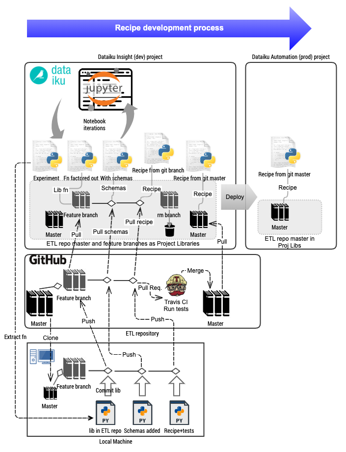
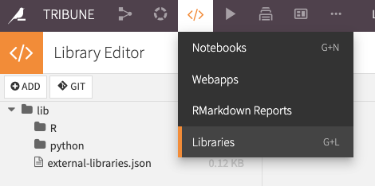
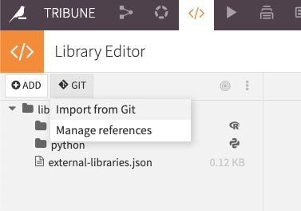
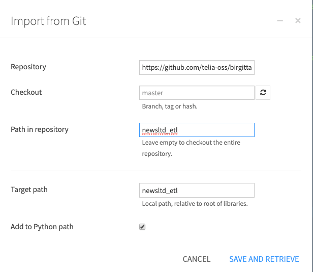
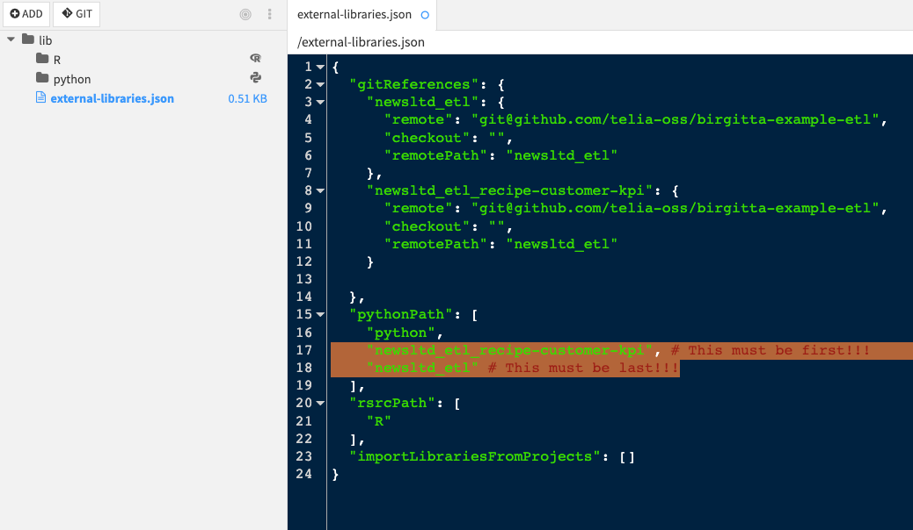
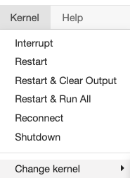

# A Git-based Dataiku DataOps development process for pyspark recipes

This tutorial presents a development process for pyspark recipes on Dataiku, based around git and the [Birgitta](https://github.com/telia-oss/birgitta) ETL test and schema framework.

### First, some terminology...

**Recipe**, in this context, is a piece of pyspark code that is execute as a Dataiku Recipe.

**Recipe development** describes the process of going all the way from an experimental recipe to a production recipe.

The purpose is to achieve **stable and solid** production recipes while still enabling **experimentation**, in line with [DataOps](https://www.dataopsmanifesto.org/) thinking.

The **ETL repository** is your organization's git repository for storing recipes, schemas, fixtures, tests and shared functions for pyspark ETL. It's role will be gradually explained below.

# Recipe development


Here, we explain how recipes can be developed from experimental notebook code into more solid production recipes.

## Experiments vs production

A recipe often starts with a notebook experiment to create some new data set from one or other two datasets. As the output data set starts to resemble what we need, we want to deploy it to be executed periodically on our production system.

## Production-readiness

To make a recipe ready for production with Birgitta, we must:

1. Factor our common functionality to git modules, e.g. like [the periods.group_by_day() function](https://github.com/telia-oss/birgitta-example-etl/blob/bd9ff3a45ae22207a08ff9e4811c2d63a408805d/newsltd_etl/libs/periods/__init__.py#L10).
2. Add [schemas ](https://github.com/telia-oss/birgitta-example-etl/blob/master/newsltd_etl/projects/chronicle/datasets/contract_data/schema.py)to git.
3. Verify the [schema](https://github.com/telia-oss/birgitta-example-etl/blob/master/newsltd_etl/projects/chronicle/datasets/contract_data/schema.py) of input and output data sets, using [dataframe.write() and read()](https://github.com/telia-oss/birgitta/blob/4ee6dd01d3d15c924edc7ae8393ff3bd484db1e9/examples/organizations/newsltd/projects/chronicle/recipes/compute_contracts.py#L33).
4. Submit [the recipe to git](https://github.com/telia-oss/birgitta-example-etl/blob/master/newsltd_etl/projects/chronicle/recipes/compute_contracts.py).
5. Add [recipe unit tests with fixtures](https://github.com/telia-oss/birgitta-example-etl/blob/master/newsltd_etl/projects/chronicle/tests/recipes/test_contracts.py), so the it's correctness is tested.
6. [Override the dataiku recipe code](https://tsnwiki.atlassian.net/wiki/plugins/viewsource/viewpagesrc.action?pageId=1569260230#DataikuPysparkRecipeDevelopmentProcess-GitOverride) by invoking the git version of the recipe and exit.

## Moving from experiment to production-ready

Here are the steps of the process of converting experimental code into production code, to comply with the list above.

### Create a branch

The first step is to create a branch. If your recipe is called `compute_customer_kpi`, then your branch should be called `recipe-customer-kpi`. Checkout the branch, or start working on it directly in your web browser, on the github page of your ETL repository. For the purpose of demonstation, we will use our example birgitta repository, with https://github.com/telia-oss/birgitta-example-etl/tree/master/newsltd_etl as our ETL folder.

### Factor out common functionality to modules in git

To improve code quality and readability it is often useful to factor out common functionality to functions or classes, e.g. like [the periods.group_by_day() function](https://github.com/telia-oss/birgitta-example-etl/blob/bd9ff3a45ae22207a08ff9e4811c2d63a408805d/newsltd_etl/libs/periods/__init__.py#L10). The modules should be added under `/libs/` in your repo organization folder, in our case https://github.com/telia-oss/birgitta-example-etl/tree/master/newsltd_etl/libs. All code should be covered by tests, added under `libs/tests`, like https://github.com/telia-oss/birgitta-example-etl/blob/master/newsltd_etl/libs/tests/periods/test_group_by_day.py. Typically, you will factor out code to improve readability or share functionality between recipes. [Here is an example](https://github.com/telia-oss/birgitta-example-etl/blob/master/newsltd_etl/libs/periods/__init__.py). 

When the libs code is ready to run, add a commit. This does not have to be a final commit, as Dataiku can use code from unmerged (unfinished) branches.

### Importing code from your ETL repository

The first step of using code from your ETL repository is to add the master branch of that repository as a git module in the library editor, and afterwards do the same with the development branch `recipe-customer-kpi`.

### Import your master branch of the ETL project as a python library

In Dataiku, we are in the `TRIBUNE` project. Go to project → libraries:




There, do `Import from Git`:




We will use these settings:

- Repository: https://github.com/telia-oss/birgitta-example-etl/
- Checkout: `master`
- Path in repository: `newsltd_etl`
- Target path: `newsltd_etl`, i.e. the sub path where your module code resides in your ETL repository




We reference a sub path in the repository, since, the etl (or so-called organization) module is the sub-folder `newsltd_etl`.

### Import your branch to the project, overriding master branch with your development branch

Follow the same steps above, but this time the checkout field should not be `master`, but rather `recipe-customer-kpis`.

### Modify python library loading path, to enable master branch override

Then modify `extenal-libraries.json` so that the `recipe-customer-kpi` branch overrides code in the master branch, by having it load first:



### Update from git

Whenever you commit new code to your branch, press Update from Git on the library in the Library editor list:


If you are in notebook mode, you also need to switch the kernel twice (back and forth to some other kernel, e.g. from py3 to py2 and back) to force the reconstruction of the root folder structure for your notebook, to get the new updates. 





Hopefully, in the future, Dataiku will provide a more elegant solution to get updates from git, directly from the notebook, like a `refresh libs` button.

### Extracting code for refactoring

Now, let's say you have a function group_by_day() which you want to reuse across recipes, you can then add it to your github library and press [Update from Git](#markdown-header-updated-from-git), and import it from the git based module, while removing it from your recipe code.

In our recipe, from our [git repo](https://github.com/telia-oss/birgitta-example-etl/blob/master/newsltd_etl/libs/periods/__init__.py) we can invoke the [function](https://github.com/telia-oss/birgitta-example-etl/blob/master/newsltd_etl/libs/periods/__init__.py) by importing the `periods` module:

```python
from newsltd_etl.libs import periods

group_keys = ['prod_code', 'shop_code', 'channel']
from_date_field = 'from_date'
to_date_field = 'to_date'
grouped = periods.group_by_day(fixtures,
                               group_keys=group_keys,
                               from_date_field=from_date_field,
                               to_date_field=to_date_field,
                               join_partitions=1,
                               count_partitions=1,
                               min_cutoff_date=min_date,
                               max_cutoff_date=max_date,
                               spark_session=spark_session,
                               drop_date_fields=True)
```

Whatever version of modules existing in the `recipe-customer-kpi` branch will be loaded before the master branch, allowing us to make continuous changes to the git version while testing it in the recipe, and also, **not interfering** with the work of colleagues working in the same project. Note that for each new commit to our dev branch `recipe-customer-kpi` we must [Update from Git](https://tsnwiki.atlassian.net/wiki/plugins/viewsource/viewpagesrc.action?pageId=1569260230#DataikuPysparkRecipeDevelopmentProcess-update-from-git) button on the branch version of the repo (newsltd_etl_recipe-customer-kpi).

### Adding schemas

We will now explain how to add versioned schemas to output and input data sets.

#### Install Birgitta

Install [the Birgitta pip package](https://pypi.org/project/birgitta/) in your [Dataiku Code environment](https://doc.dataiku.com/dss/latest/code-envs/index.html).

#### Adding output schema

Adding schemas is a tool for robustness in your recipes, and is a precondition for the [birgitta unit tests](https://github.com/telia-oss/birgitta-example-etl/blob/master/newsltd_etl/projects/chronicle/tests/recipes/test_contracts.py). The first step is to define the output schema, which is passed to [dataframe.write()](https://github.com/telia-oss/birgitta-example-etl/blob/bd9ff3a45ae22207a08ff9e4811c2d63a408805d/newsltd_etl/projects/chronicle/recipes/compute_contracts.py#L33):

Initially, in dataiku recipes a data set is written with `dkuspark.write_with_schema()`. This must be change to use `birgitta.dataframe.write()`:

```python
#### Old dataiku version:
# dku_contracts = dataiku.Dataset("contracts")
# dkuspark.write_with_schema(dku_contacts, to_output_df)
# #### Now changed to:
from newsltd_etl.projects.chronicle.datasets.contracts import dataset as ds_contracts
dataframe.write(to_output_df, "contracts", schema=ds_contracts.schema)
```

For this to work we first need to add that [schema](https://github.com/telia-oss/birgitta-example-etl/blob/master/newsltd_etl/projects/chronicle/datasets/contracts/schema.py) to github. The file must look like this:

```python
from birgitta.schema.schema import Schema 
from newsltd_etl.shared.schema.catalog.tribune_chronicle import catalog  
fields = [
     ['customer_id', 'bigint'],
     ['phone', 'string'],
     ['chronicle_account_id', 'bigint'],
     ['group_account_id', 'bigint'],
     ['start_date', 'date'], 
     ['end_date', 'date'],
     ['priceplan_code', 'string'],
     ['current_flag', 'bigint'],
     ['client_status_code', 'bigint']
]
schema = Schema(fields, catalog)
```

The [catalog](https://github.com/telia-oss/birgitta-example-etl/blob/master/newsltd_etl/shared/schema/catalog/chronicle.py) defines all the fields we have in our domain. [New entries with example values](https://github.com/telia-oss/birgitta-example-etl/blob/master/newsltd_etl/shared/schema/catalog/chronicle.py) must be added for all fields we have in the schema. This serves both as documentation and for creating test fixtures. Also, it serves as a data field catalog, helping us to organize our field names.

When the [schema](https://github.com/telia-oss/birgitta-example-etl/blob/master/newsltd_etl/projects/chronicle/datasets/contracts/schema.py) and the [catalog entries](https://github.com/telia-oss/birgitta-example-etl/blob/master/newsltd_etl/shared/schema/catalog/chronicle.py) have been added to our new git branch, we press [Update from Git](#markdown-header-updated-from-git) again, and can start using them. We can now execute the `dataframe.write()` line with the added protection of a schema.

This can be tested in a notebook or in Dataiku recipe mode without adding input schemas.

#### Simple way of deriving schema

The actual schema itself can be derived by using the utility function [birgitta.schema.spark.from_spark_df()](https://github.com/telia-oss/birgitta/blob/4c7ede5098254a4dbed9e2ef5672ba3e1a89f9f4/birgitta/schema/spark.py#L70) in a notebook:

```python
from birgitta.schema import spark as schemaspark
# to_output_df is the schema we want to get the schema from:
schemaspark.from_spark_df(to_output_df)
# Output:
# fields = [
#     ['customer_id', 'bigint'],
#     ['phone', 'string'],
#     ['chronicle_account_id', 'bigint'],
#     ['group_account_id', 'bigint'],
#     ['start_date', 'date'],
#     ['end_date', 'date'],
#     ['priceplan_code', 'string'],
#     ['current_flag', 'bigint'],
#     ['client_status_code', 'bigint']
# ]
```


#### Adding input schemas

To add input schemas, we follow the same methodology as for adding the output schema. Add schemas for every input dataset. Currently, schemas are not enforced on `dataframe.read()` but this will be added in the future to [birgitta.dataframe](https://github.com/telia-oss/birgitta/blob/master/birgitta/dataframe/dataframe.py).

You must replace all your `dkuspark.get_dataframe()` calls with birgitta's `dataframe.read()` commands, in order for your units test to be able to run locally:

```python
#### Old dataiku version:
# contract_data_ds = dataiku.Dataset("contract_data")
# contract_data_df = dkuspark.get_dataframe(sqlContext, contract_data_ds)
#### Now changed to:
from newsltd_etl.projects.chronicle.datasets.contract_data import dataset as ds_contract_data
contract_data_df = dataframe.get(spark_session, ds_contract_data.name)
```

## Writing tests and committing recipe

When a recipe seems stable, copy the code into a python file on your local machine where you have a clone of [the analytics-no repo](https://github.com/TeliaSoneraNorge/analytics-no/). If the recipe is in the dataiku project `chronicle`, and is called `compute_contracts.py` then the code should go in the path `[newsltd_etl/projects/chronicle/recipes/compute_contracts.py](https://github.com/telia-oss/birgitta-example-etl/blob/master/newsltd_etl/projects/chronicle/recipes/compute_contracts.py#L33)`.

Then we need to add testing code to test the recipe.

### Writing the test

Here is an example of how the test should look, and what its path should be: [newsltd_etl/projects/chronicle/tests/recipes/test_contracts.py](https://github.com/telia-oss/birgitta-example-etl/blob/master/newsltd_etl/projects/chronicle/tests/recipes/test_contracts.py).

### Running the test

If you set up your reposity like [birgitta-example-etl](https://github.com/telia-oss/birgitta-example-etl). You can run the test with `make test` from the root of the repository. You can also run the test with:

```python
pytest newsltd_etl/projects/chronicle/tests/recipes/test_contracts.py
```

To set up the repository, see the install instructions in [birgitta-example-etl](https://github.com/telia-oss/birgitta-example-etl). It shows how to add automatic testing with travis on Pull Request merge.

Note that on Dataiku, the pip modules your recipes depend on must be installed in your [Dataiku Code Environment](https://doc.dataiku.com/dss/latest/code-envs/index.html). Dataiku unfortunately does not install dependent module when adding a git repository as a python module.

When the test runs green, you can commit the recipe and the tests to your branch.

In the future we might add helper functions for executing github recipe tests directly from Dataiku, for convenience to avoid having to set it up locally.

## Git-override recipe

When a stable and tested version of the recipe has been added to git, the recipe in Dataiku should be short cut with a git runner `run_and_exit()` call. This way the code that is run is the tested and versioned code from git.

The old code can be left below for convenience, if you want to go back and hack around on it later. Some people might prefer to just delete the old code.

```python
from birgitta.dataframesource.sources.dataikusource import DataikuSource
from birgitta.recipe import runner from examples.organizations.newsltd.projects import tribune

runner.run_and_exit(tribune, "recipes/compute_filtered_contracts.py", DataikuSource())

### The recipe below stays the same, but code is never run ###
# -------------------------------------------------------------------------------- NOTEBOOK-CELL: CODE from birgitta import spark as bspark from birgitta.dataframe import dataframe from pyspark.sql import functions as F from examples.organizations.newsltd.projects.tribune.datasets.filtered_contracts import dataset as ds_filtered_contracts # noqa 501 from examples.organizations.newsltd.projects.tribune.datasets.contracts import dataset as ds_contracts # noqa 501
# -------------------------------------------------------------------------------- NOTEBOOK-CELL: CODE #  Get or create sparkcontext and set up sqlcontext
spark_session = bspark.session()
# -------------------------------------------------------------------------------- NOTEBOOK-CELL: CODE
contracts = dataframe.get(spark_session,
                      ds_contracts.name,
                      cast_binary_to_str=True)
...  
```

Note that the old code is exactly the same as the code in git, including the usage of schemas `birgitta.dataframe.read()` and `write()`.

With the new code in git, the Dataiku project can now be more safely deployed to production.

## Git based updates of Dataiku production recipes without redeploy

An added benefit is that any new changes merged into git will be picked up by your Dataiku production recipe, when you press [Update from Git](#markdown-header-updated-from-git) in the Production project library editor. No need to redeploy the bundle. This is possible because the code being run comes from git and not from the recipe interface.

## Merging your PR into production

If you base your ETL repository on [birgitta-example-etl](https://github.com/telia-oss/birgitta-example-etl), you can easily add support for automatic unit testing of recipes on Pull Request merge (see [.travis.yml](https://github.com/telia-oss/birgitta-example-etl/blob/master/.travis.yml)). When your Pull Request tests run green, you can more safely merge to master, than without tests and schemas.

After merging to master, and before deploying your Dataiku project to Automation (production), **remember to remove the imported library** based on the `recipe-customer-kpi` branch, so that only the master branch library remains.

## Iterative improvements and refinement

Often you will want to come back to your recipe and do changes or improvements. Then you simply comment out the `runner.run_and_exit()` lines at the top of your recipe interface and continue to work in your code. When you have the improvements ready, you add them to a new branch and run your tests locally. When running green, you create a Pull Request. After the changes have been merged into master you can reenable `runner.run_and_exit()`, but make sure you [Update from git](https://tsnwiki.atlassian.net/wiki/plugins/viewsource/viewpagesrc.action?pageId=1569260230#DataikuPysparkRecipeDevelopmentProcess-update-from-git) on your ETL git library in your Dataiku project library editor. On the Dataiku Automation node you just need to [Update from Git](#markdown-header-updated-from-git) to get the latest changes.

## Advanced testing

Some advanced testing features to mention are multiple fixtures, JSON fixtures and transformation coverage testing.

### Multiple fixtures

If needed, you can cover more logic in our recipes with [multiple sets of fixtures](https://github.com/telia-oss/birgitta-example-etl/blob/master/newsltd_etl/projects/tribune/tests/fixtures/contracts.py). Here is an example:

```python
def fx_default(spark):
    return fixtures.df(spark, schema)


def fx_brand_code_44(spark):
   row_confs = [
       {"brand_code": {"example": {"static": 44}}}
   ]
   return fixtures.df(spark, schema, row_confs)
```

You need to have the same fixtures available for all input and output fixtures for a recipe test. You then explicitly invoke both variations of the [test](https://github.com/telia-oss/birgitta-example-etl/blob/master/newsltd_etl/projects/tribune/tests/recipes/test_filtered_contracts.py):

```python
def test_default(run_case):
    run_case("default")


def test_brand_code_44(run_case):
    run_case("brand_code_44")
```

### JSON fixtures

For debugging and visualization, birgitta supports generating JSON examples of your fixtures. In [birgitta-example-etl](https://github.com/telia-oss/birgitta-example-etl) this is invoked by running `make json_fixtures` which in turn calls a [python script](https://github.com/telia-oss/birgitta-example-etl/blob/master/make_json_fixtures.py) which contains the following:

```python
import newsltd_etl from birgitta.schema.fixtures import json as fx_json
fx_json.make(newsltd_etl)
```

Here is an [example JSON output of the brand_code_44 fixture for contracts](https://github.com/telia-oss/birgitta-example-etl/blob/master/newsltd_etl/projects/tribune/tests/fixtures/generated_json/contracts/fx_brand_code_44.json).

### Transformation coverage

See https://github.com/telia-oss/birgitta#transformation-coverage-testing.
